# 命题

合取 俩都得是真才算真

析取 一个真就算真

异或  必须有一真一假

蕴含 只有前真后假为假

双条件 同真同假 才为真

复合命题:运算符有优先级 显示否定 然后合取析取 然后-> 最后 <->

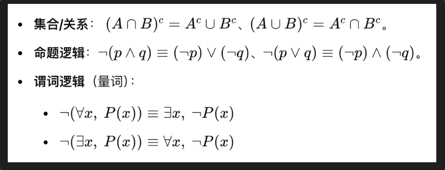

永真式所有赋值都真  矛盾式都假 偶真式不一定

# 集合

### 证明两个集合相等:

a是b自己b也是a子集

证明a的所有元素都属于b就好了

### 集合的基数-无限集合的比较

1. **等势（基数相等）**：
   * 如果存在一个从集合 A 到集合 B 的双射函数，则称 A 和 B 等势，记作 |A| = |B|
   * 例如：自然数集和偶数集等势（可以通过函数 f(n) = 2n 建立双射）
2. **基数大小比较**：
   * 如果存在从集合 A 到集合 B 的单射函数，但不存在双射函数，则称 A 的基数小于 B 的基数，记作 |A| < |B|
   * 例如：自然数集到实数集只能建立单射，不能建立双射（康托尔定理）

### 这样子可以证明可数不可数  如果和自然数基数相等就是可数 (比如有理数 , 无理数不相等)下面例有理数的为什么可数:

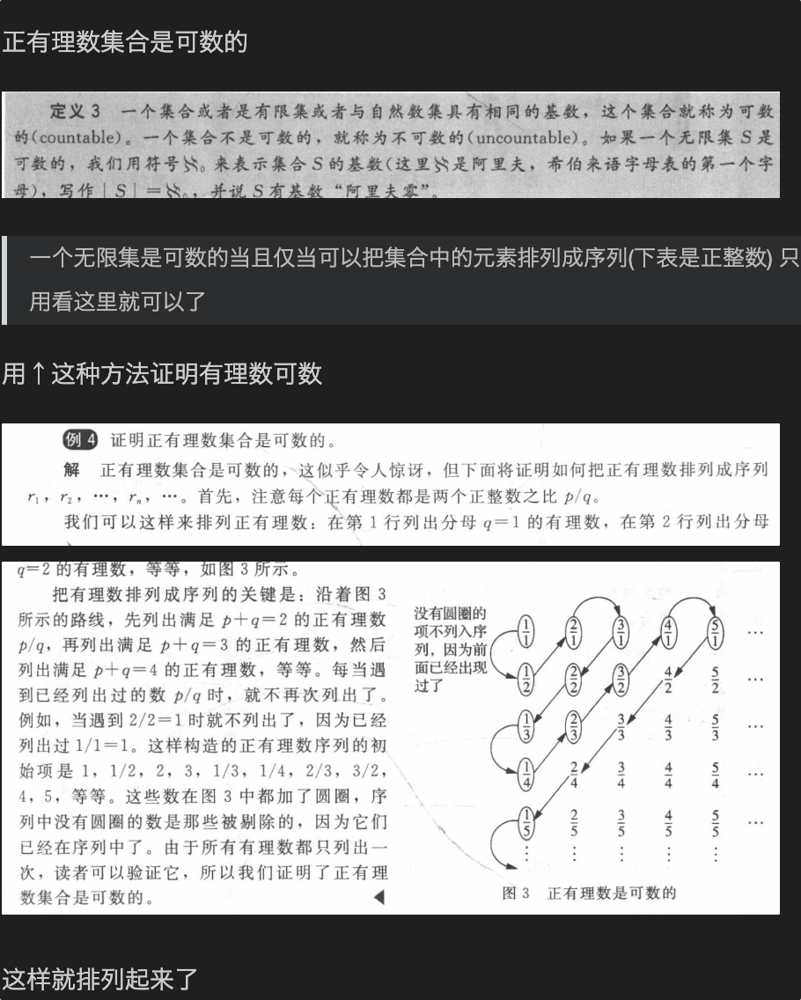

### powerset幂集

所有子集的集合 写P(A)

# 函数

### 全然性唯一性

全然性: 每个A的元素必须都对应出去

唯一性: 每个A的元素只能对应一个B的元素

### 三个性质的函数

单射/一对一 满射/映上 双射

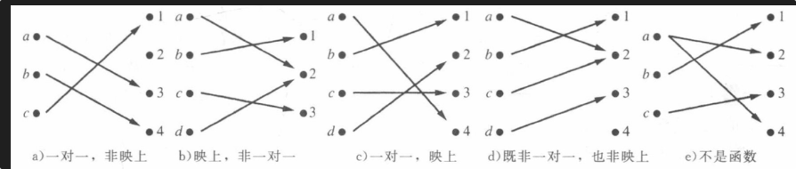

证明单射: 任意的/所有的 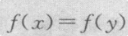都有x=y

> 只要证明一对一

证明不是单射:fxfy 有了x!=

证明满射 只要证明任意的y 都有一个x让fx=y

不是满射 找到一个特定y让 即使取任意的x都找不到fx=y

> 找一个没有对应上b的

反函数:双射才能反函数

复合函数 注意正反

fog是f(g(x))

# 计数

广义鸽巢原理

扑克牌问题
问题：从标准扑克牌（52张）中抽取牌，至少有3张属于同一花色，需要抽几张牌？

2*4 +1

---

### 排列组合

排列数 P(n,r)  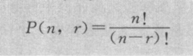

组合数 c(n,r) 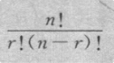

也写作 (       ) 上面是总数 下面是多少个组合

帕斯卡恒等式: 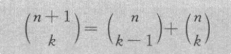

也可以写   $C(n,r) =  C(n-1,r)+ C(n-1,r-1)$

### 广义排列组合

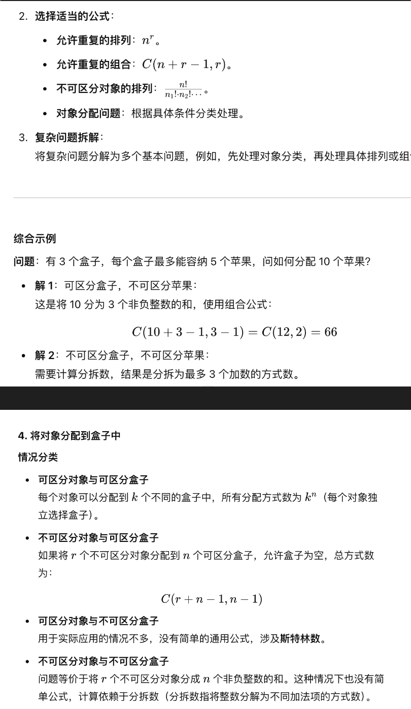

二项式定理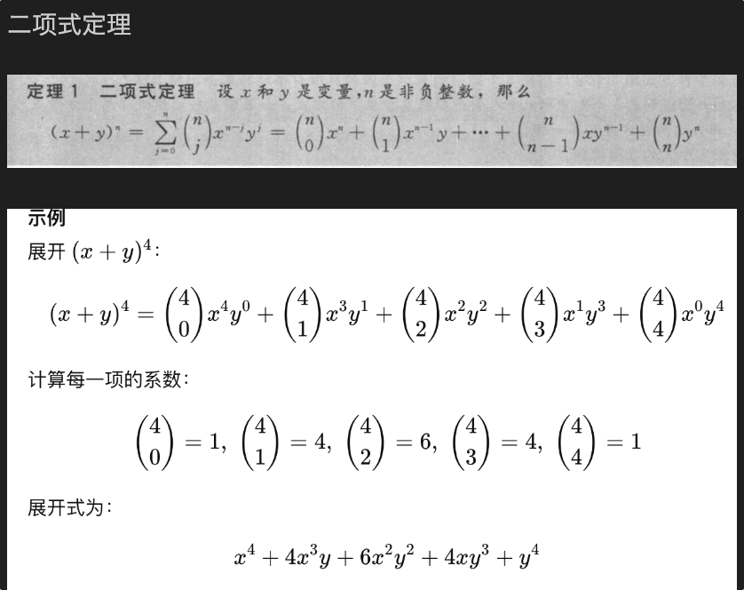

# 高级计数

求递推关系---等待例题  上楼梯  等等

求解递推关系:

### 常系数线性齐次

$a_{n-k}$

k是阶数   最大的那个k就是阶数

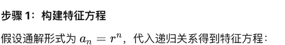

然后左右同除   最后解方程的r的解

没有重根: 有k阶的话:

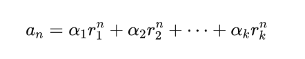

有m个重根: 重根的部分:

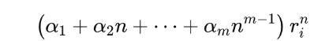

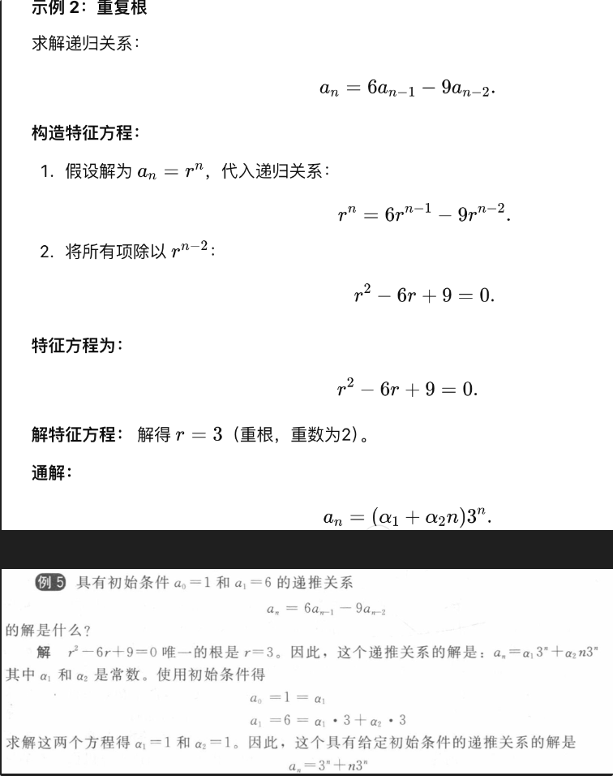

### 常系数线性非齐次

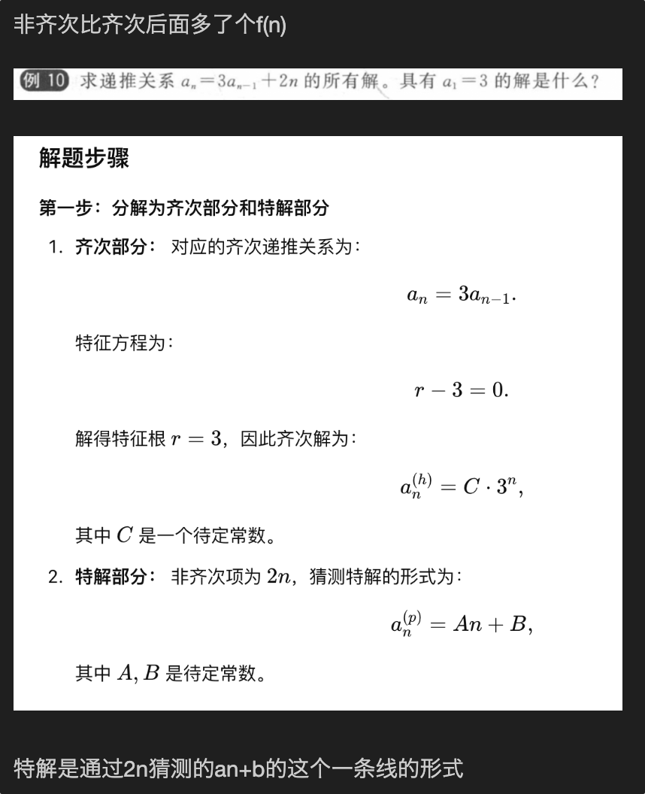

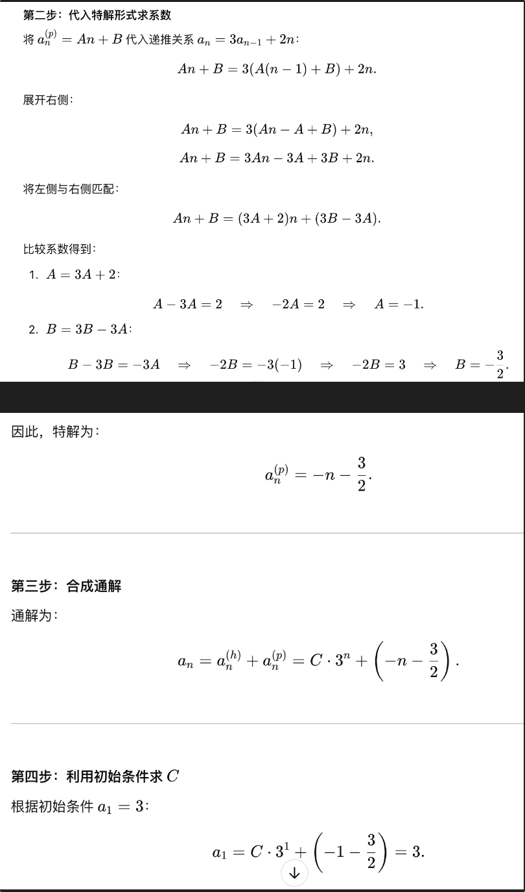

# 关系

### 性质的判定

自反

> 所有的元素都有(自己,自己)的关系 空集是自反 因为前提假关系就为真

对称

> 如果有ab总有ba 就像朋友关系

反对称

> 反对称就是对称位置没有关系 除非相等 例如大于等于关系 只有在相等的时候正反都成立

传递

> 例如 a小于等于b

操作:

### 关系复合

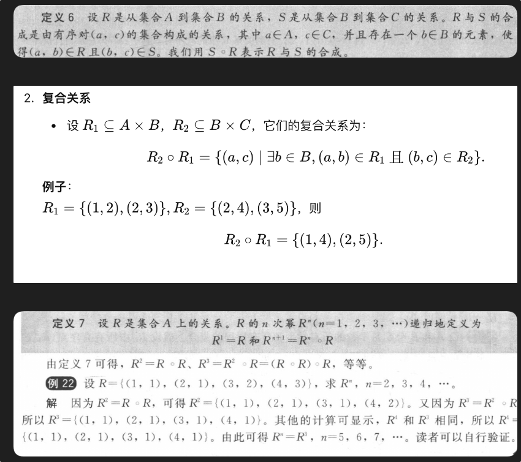

### 关系的逆

关系的逆是指将关系中的每一对元素的顺序颠倒后得到的新关系。具体来说，如果 R 是一个关系，并且 (a, b) 是 R 中的一对元素，那么 R 的逆关系 R⁻¹ 包含 (b, a)。

### 关系表示

注意:矩阵的话 是先横再竖

有向图:

```bash
a1 ↺ 自反
a1 ↔ a2 ↔ a3 对称
a1 → a2 → a3 反对称

```

自反性：所有顶点都有自环。

对称性：如果有边 **(**a**,**b**)**，则必须有边 ((**b**,**a**)**。

反对称性：若有边 (**a**,**b**)**，则不能有边 (**(**b**,**a**)**（相等）。

传递性：如果有边 (**a**,**b**)和 (**b**,**c**)**，则必须有边 **(**a**,**c**)**。

### 等价关系

一个大集合里的一个关系$R$满足自反 对称 传递性  那就是等价关系.

求等价类

> 等价关系将集合 $A$ 划分为若干个等价类。每个等价类是集合 $A$ 的一个子集，其中的元素彼此等价。

所有A中与a有关系的集合

```bash
假设我们有一个集合 S = {1, 2, 3, 4}，等价关系 R 定义为 "模 2 同余"。也就是说，两个元素 a 和 b 是等价的，当且仅当 a ≡ b (mod 2)。

确定等价关系：R 是 "模 2 同余"。
找出所有与 a 相关的元素：假设我们要找元素 1 的等价类。
1 ≡ 1 (mod 2)
3 ≡ 1 (mod 2)
构建等价类：元素 1 的等价类是 {1, 3}。
因此，元素 1 的等价类 [1] = {1, 3}。
```

一个集合中可以有多少种等价关系  即问:关系的划分 可以用到加法原则:

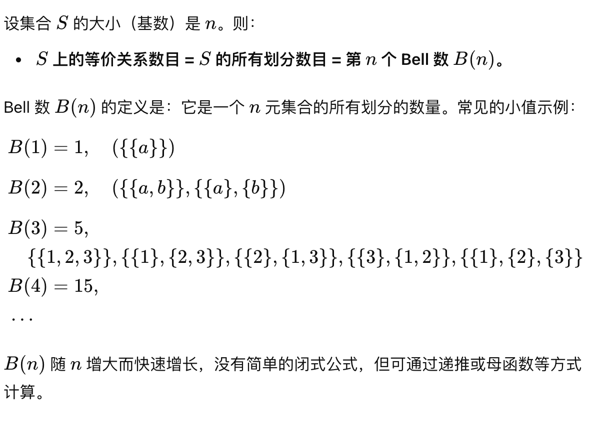

#### 偏序关系

自反+反对称_传递的关系

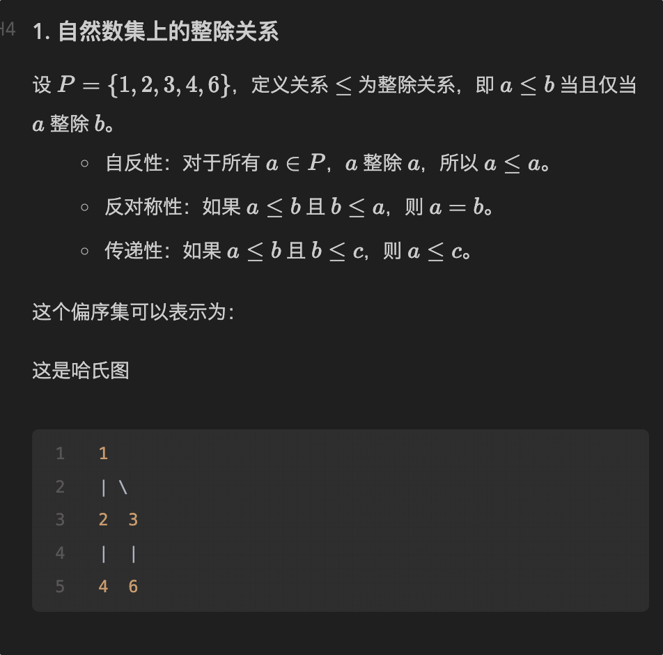

Hasse 图

根据上述关系构造 Hasse 图（省略自反和传递边）：

```css
  e       f
   \     /
    \   /
     d
    / \
   b   c
    \ /
     a

```

### 1. 上界与下界

- **子集**：\( T = \{b, c\} \)

#### 上界：

- 一个元素是 \( T \) 的上界，当且仅当它比 \( T \) 中所有元素大（或等于）。
- **结果**：\( \{d, e, f\} \) 是 \( T \) 的上界。

#### 最小上界（LUB）：

- \( d \) 是 \( T \) 的最小上界（比 \( d \) 更大的上界是 \( e \) 和 \( f \)）。

#### 下界：

- 一个元素是 \( T \) 的下界，当且仅当它比 \( T \) 中所有元素小（或等于）。
- **结果**：\( \{a\} \) 是 \( T \) 的下界。

#### 最大下界（GLB）：

- \( a \) 是 \( T \) 的唯一下界，因此也是最大下界。

### 2. 极大元素与极小元素

- **集合**：整个集合 \( S \)

#### 极大元素：

- 没有其他元素能支配它的元素。
- **结果**：\( \{e, f\} \) 是极大元素（它们没有后继）。

#### 极小元素：

- 没有其他元素能被它支配的元素。
- **结果**：\( \{a\} \) 是极小元素（它没有前驱）。

1. **上界与下界**：

   - \( T = \{b, c\} \) 的所有上界是 Hasse 图中位于 \( b, c \) 上方的节点（\( d, e, f \)）。
   - 所有下界是位于 \( b, c \) 下方的节点（\( a \)）。
2. **极大与极小元素**：

   - 极大元素是 Hasse 图中没有出边的节点（最高点）。
   - 极小元素是 Hasse 图中没有入边的节点（最低点）。

全序关系 全序在偏序关系的基础上还要求集合的所有元素都可以比较

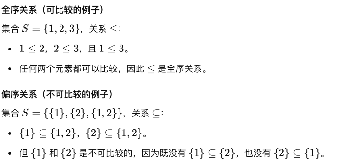

# 图论

简单图 多重图-可以有多重边

有向图 无向图 有没有方向

### 图的关系

邻接关系 点和点的关系

- 无向图**：在无向图中，如果两个顶点 $u$ 和 $v$ 之间有一条边连
- **有向图**：在有向图中，如果存在一条从顶点 $u$ 指向顶点 $v$ 的有向边，则称 $u$ 和 $v$ 是邻接的，记作 $u \rightarrow v$。

#### 关联关系(点和边的关系)

- 无向图：在无向图中，如果顶点 $v$ 是边 $e$ 的一个端点，则称顶点 $v$ 和边 $e$ 是关联的。
- **有向图**：在有向图中，如果顶点 $v$ 是边 $e$ 的起点或终点，则称顶点 $v$ 和边 $e$ 是关联的。

握手定理  度的和=点数*2

环路度算两次  有向图的话入1 出1

### 特殊图:

* 正则图 每个顶点的度数都相同
* 完全图 每一对不同顶点都有两条方向相反的边相连
  * 表示:  $Kn$ n个顶点的完全图--- 特点
* $Cn$ n个顶点的环图
* 二部图(二分图)红蓝二着色略
  * 二部图-完全二部图 每一个红定点都连接了所有蓝 反之也是   写作$k_{2,3}$

### 图的表示

稀疏图(边的数量远小于顶点平方) 邻接表 a   |   b,c,d

稠密图  邻接矩阵

有向图 无向图的邻接矩阵之类的表示 先横再竖

### 判断同构

检查每一部分都一一对应太过困难   不可行

可以检查 `图形不变量`  相同的顶点数 相同的边数 相同的度

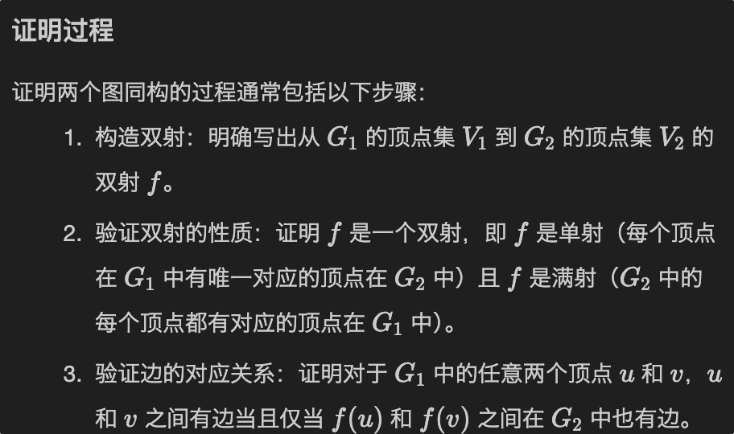

> 橡皮筋法判断

### 连通性:

简单通路 (边不重复的路)

简单回路 (边不重复的回路 环)

> 注意与欧拉回路等区分  简单路/回路比一般路要求更严格  欧拉通路/回路最严格

联通分量是一个极大联通子图

强连通分量 -~ 子图    弱联通分量 - ~ 子图

强联通(任意两个点相互可达)与弱连通(方向去掉是无向连通图)

> 找强联通分量 如果找到了一个有向圈包含所有顶点 那就是强联通

### 欧拉

通路:

- 无向图：恰好有两个顶点的度数是奇数，其他顶点的度数都是偶数，并且图是连通的。

  - 顺便 这两个奇数的点就是起点和终点
- 有向图：恰好有一个顶点的出度比入度大1，恰好有一个顶点的入度比出度大1，其他顶点的入度等于出度，并且图是弱连通的。

  - 这两个也是起点终点

回路:

存在条件**：

- 无向图：每个顶点的度数都是偶数，并且图是连通的。
- 有向图：每个顶点的入度等于出度，并且图是强连通的。

> 注意欧拉图是有回路的图!!

### 哈密顿

一般也就在无向图找哈密顿

哈密顿回路 判定: 没有充分必要条件  只能说比较稠密 度比较大容易有回路存在不能,....

但有充分条件:

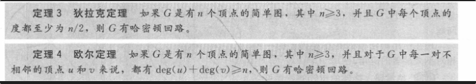

完全图k>3也有哈回

> 哈密顿也是  回路的图!!!

# 树论

### 数的定义:

> 连通无圈!

有根树

是指定一个顶点作为根并且每条边的方向都离开根的树.

前序 根 左后右

中序 左根右

后序 左 右 根

哈夫曼编码:

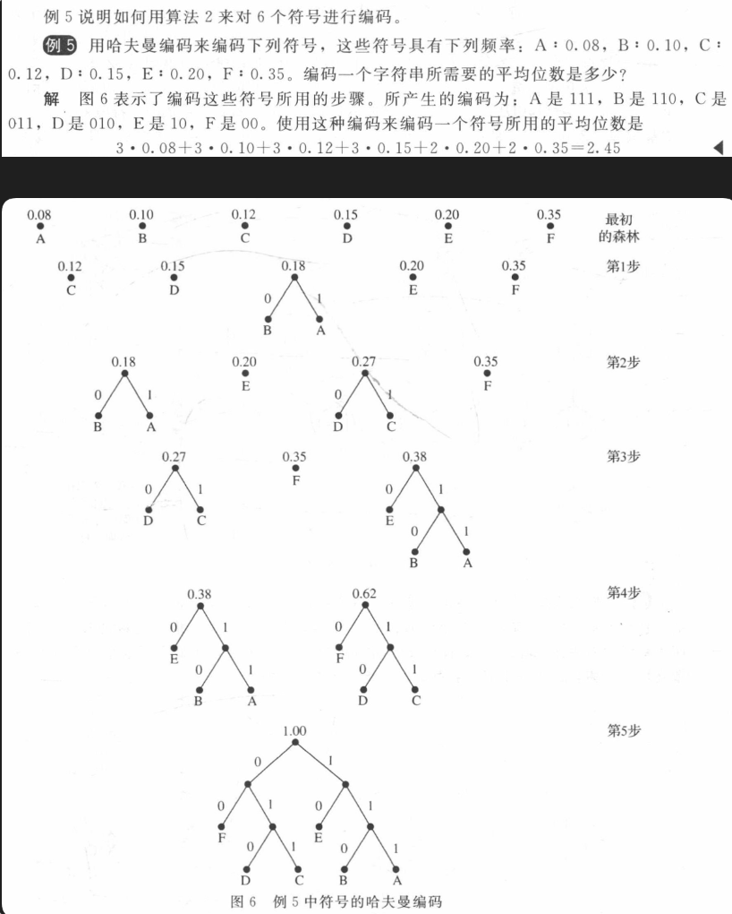

最小生成树

深度优先 回头 广度优先 一次一次

# 三大算法

### dj

### **Prim算法**

**步骤：**

1. 任意选择一个顶点作为起始点，将其加入生成树。
2. 选择一条连接生成树中顶点与非生成树顶点的最小权重边，将该边和对应顶点加入生成树。
3. 重复步骤 2，直到所有顶点都在生成树中。

### **Kruskal算法**

**步骤：**

1. 按权重升序排列所有边。
2. 初始化生成树为空。
3. 从最小权重边开始，逐一选择，加入生成树，但不能形成回路。
4. 重复步骤 3，直到生成树有**n**−**1** 条边。
