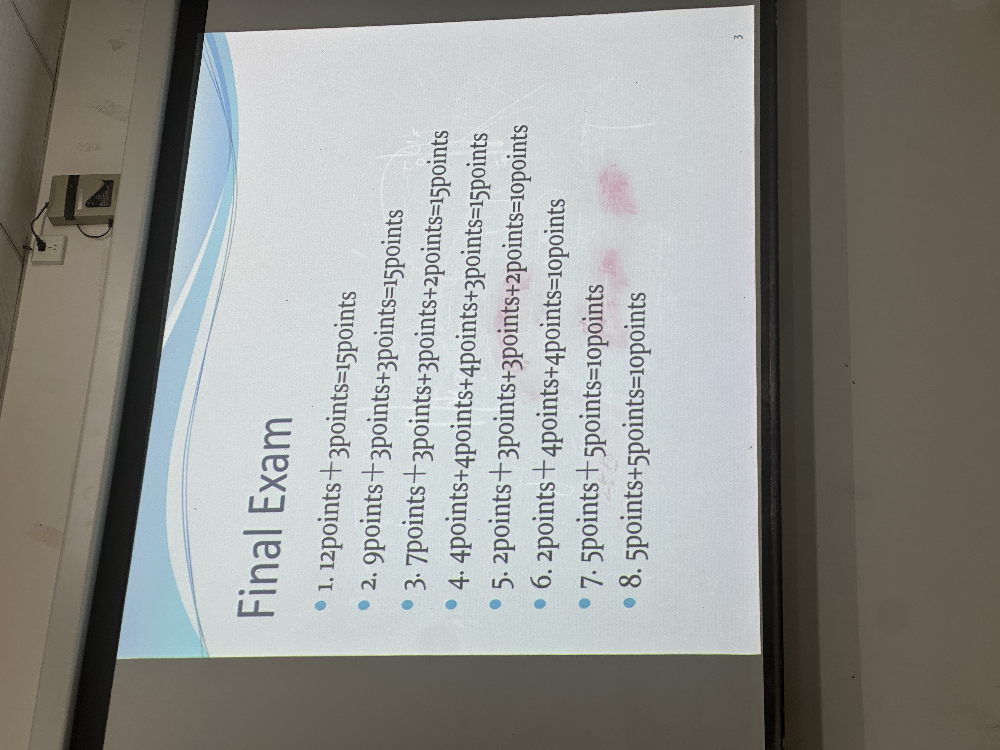

# 复习大纲



# 逻辑

> 逻辑一定有大题

## 命题逻辑

什么是命题

-连接词 真值表 掌握

复合命题画真值表

> 蕴含 泳衣错-p是F 反而整个是真

判断永真式 矛盾式 偶真式

判断 可满足式

### 逻辑等价(恒等于号那个)

1. 证明
   1. 左右画真值表
   2. 等值演算法
      1. 基本等值式 例如狄摩根律 结合交换分配律

## 谓词逻辑

1. 命题 谓词概念
2. 自然语言用逻辑语言表示出来(命题的符号化)
3. 量词

   1. 全称 存在量词

谓词逻辑的等值

```
谓词逻辑的各种基本等值式
```

嵌套量词 确定真值( 相当于两层for循环)

# 集合

NZRQ 自然数 整数 实数 有理数

### 证明两个集合相等

1. a是b子集b也是a子集
   1. 子集的证明: 任挑一个左边的元素推导-右边的元素

### 集合的基数

1. 有限:集合的个数
2. 无限:
   1. 双射 集合相等
   2. 单射 一个集合更多

### powerset

一个集合的所有子集的集合

### 集合操作

1. 并交补差
2. 集合的乘法 笛卡尔积 例如 $Z^2$
3. 集合的各种等式 狄摩根律 交际变并 并变交际

# 函数

### 函数的特点

1. 全然性
2. 唯一性

### 三个性质的函数

单射 *的证明*

满射 通常按照定义证明 挑选一个都能找到映射过去

双射  结合上两个

#### 反函数

> 1. 判定是不是双射   -写出反函数

#### 复合函数

> 注意正反

---

> 以上主要靠理论 一下主要考应用

---

# 计数

加减乘除法则

广义鸽巢原理

排列组合

二项式定理

### 带重复的组合数

1. 容易出错 n和r弄错   n是不同类别的那个
2. 不定方程求解  不定方程转化为可重复组合求解( 技巧 双射)

### 往盒子中分配物品

1. 物体可区分不可区分
2. 盒子可区分不可区分
   > 1. 应用题
   >

## 高级计数

### 递推关系

### 常系数线性齐次递推关系

> 特征方程法
>
> 1. 特征方程
> 2. 求特征根
> 3. 一样套/**定理 不一样/***定理

### 常系数线性非齐次递推关系

齐次通解+非齐次特解

> 计数和高级计数 两个中会有一个题

# 关系

关系中也肯定会有一个题目

### 二元关系

### 性质的判定

> 各种性质的证明需要掌握

1. 自反
2. 对称
3. 反对称
4. 传递

### 关系的操作

1. 并 交 差
2. 关系的复合 (因为关系是函数的推广)
3. 关系的逆

### 关系的表示方式

> 关系的各种特征在图上怎么提现

1. 矩阵
2. 图

### 等价关系 偏序关系

#### 等价关系

分类操作有关

: 满足 自反 对称 传递

写一个元素的等价类(所有A中与a有关系的集合)

如问: 一个集合中可以有多少种等价关系  即问:关系的划分 可以用到加法原则

#### 偏序关系

与排序操作

: 自反 反对称

##### 哈氏图

1. 画哈氏图
2. 找特殊元素 上界下界 极大极小元

全序

# 图论

#### 应用问题转化为图模型(建模)

#### 简单图 多重图

#### 有向图 无向图

### 图的关系

临接关系

关联关系

### 度

无向图:

关联边的次数总和

环路度算两次
有向图:

入度算1出度算1

### 握手定理

有向图和无向图的版本

度数之和=边的两倍

### 特殊图

1. 正则图
2. $Kn$ n个顶点的完全图--- 特点
3. $Cn$ n个顶点的环图
4. 二部图(二分图)
   1. 着色
      完全二部图

      > 1. 着色的规则
      >

### 图的表示

稀疏图 邻接表

稠密图 邻接矩阵

有向图 无向图的邻接矩阵之类的表示

### 图同构

判断两个图是否同构

证明: 构造一个双射  证明题的过程一定要写双射

辅助方法: 橡皮筋

证明不同构:  证明各种不变量不一样

### 图的连通性

路 路的长度 回路  简单路 (边不重复的路) 简单回路 (边不重复的回路 环) 的概念

联通分量 极大联通子图

强联通(任意两个点相互可达)与弱连通(方向去掉是无向连通图)

找强联通分量 如果找到了一个有向圈包含所有顶点 那就是强联通

### 欧拉图 哈密顿图

#### 欧拉图

有欧拉回路的图

欧拉回路:   判定定理: 每个顶点都是偶数   欧拉路: 判定定理   两个是奇数 其他都是偶数

#### 哈密顿图

哈密顿回路 判定: 没有充分必要条件  只能说比较稠密 度比较大容易有哈密顿回路

没有哈密顿回路:    有一个度为1的点 度为2    $Kn$

# 树论

#### 数的定义

连通无圈

#### 数的根 叶 内部 父 子 兄弟 祖先 后代 节点

#### 子树

#### 二叉树 m叉树

#### 层数和高度

#### 有序树

### 性质

遍历方式 前序 中序 后序

### 生成树

是子图 是树 包含所有顶点

是一个连通图就有生成树  会有很多棵

遍历: 深度优先 广度优先

### 图论三大算法:

prim算法 图论三大算法

kruskal算法 图论三大算法

djistka算法 找最短路径 图论三大算法

### 哈夫曼编码

1. 统计出现频率
2. 从小到大排序
3. 两个最小的组合一个
4. 重复 哈夫曼树
5. 左边为0 右边为1
